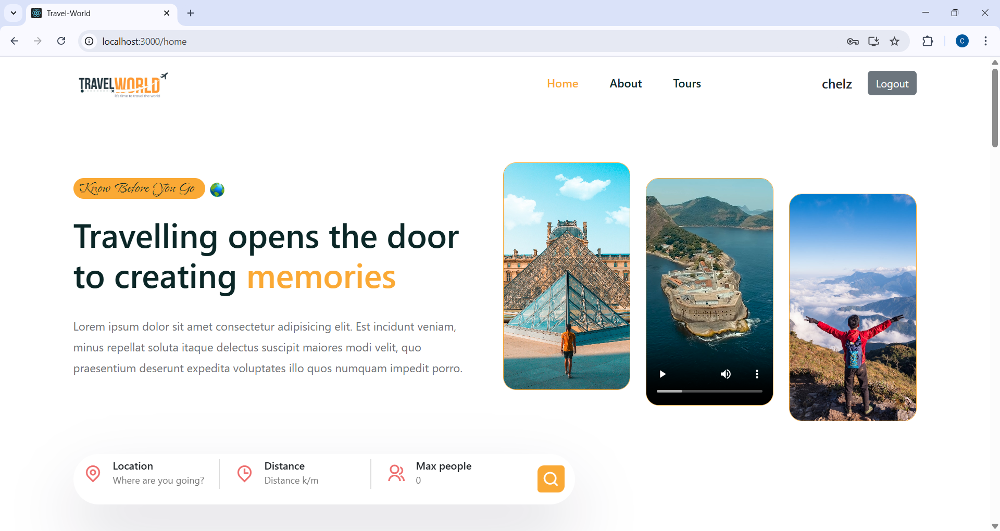
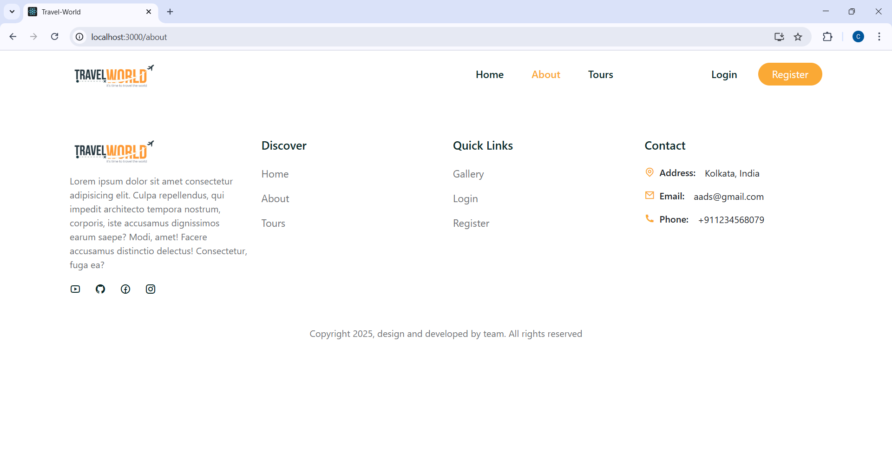
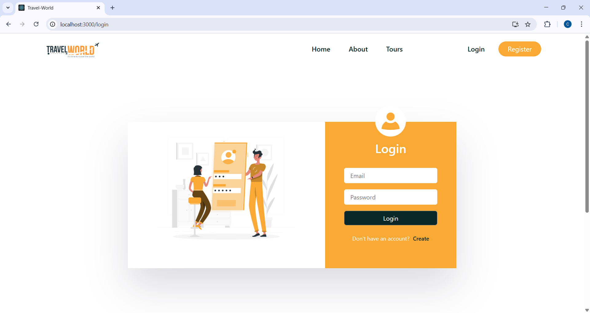
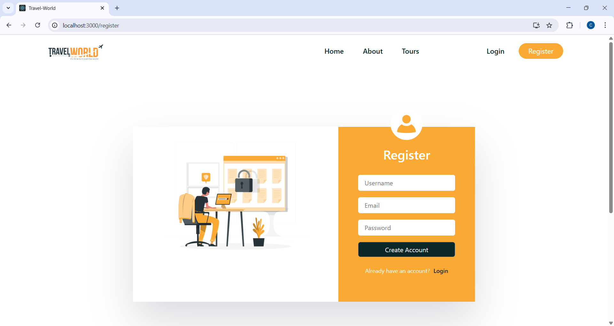
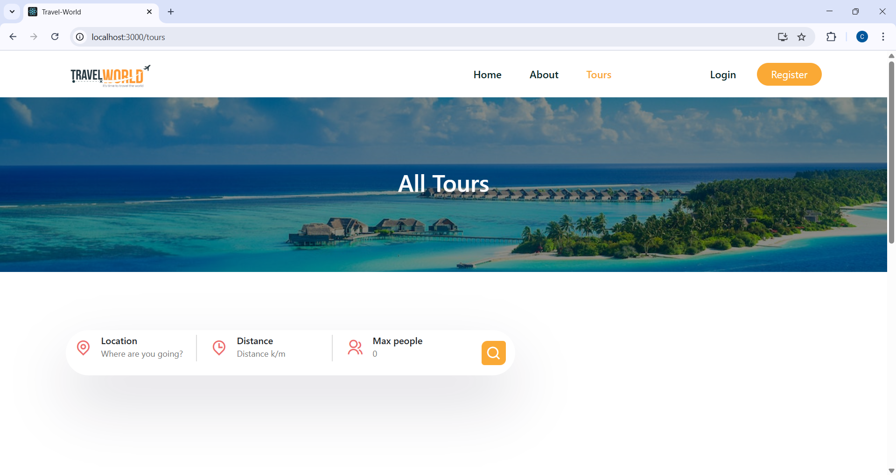

# ✈️ Travel World: MERN Stack Tours & Travel Booking Platform

> **A full-stack MERN web application engineered for high-availability tour booking and destination exploration.  
This project showcases proficiency in developing secure, scalable RESTful APIs and building robust, component-driven user interfaces—demonstrating readiness for MNC-level Full-Stack roles.**
 ---

 ## 🎯 Key Features Implemented

### 👤 User Experience & Commerce
- **🔐 Secure User Authentication:** Implemented secure login & signup leveraging JWT for stateless session management and bcrypt for irreversible password encryption.
- **🧳 Seamless Booking Flow:** User-friendly, multi-step process for selecting and booking travel packages, demonstrating transactional integrity.
- **⭐ Personalized Dashboard:** Dedicated user area to manage bookings and view saved places, showcasing database relationship management.

### ⚙️ Architecture & Data Management
- **RESTful API Design:** Clean, logical endpoint structure for efficient data transfer and client-server communication.
- **Modern UI/UX:** Highly responsive UI built with reusable React components (component-based architecture).
- **Data Persistence:** Uses MongoDB Atlas and Mongoose for efficient, schema-validated NoSQL data handling.

---

## 🛠️ Production Tech Stack

This solution validates a strong command of the industry-leading **MERN** ecosystem.

### 💻 Frontend (The Component Layer)

| Tech | Detail |
|------|--------|
| React.js | Core component-based framework for scalable UIs |
| React Router | Declarative routing for seamless SPA navigation |
| Styling | Utilized Styled Components or [Specify CSS Library] for modular, maintainable styling |

### ⚙️ Backend (The API Layer)

| Tech | Detail |
|------|--------|
| Node.js | Asynchronous runtime for high-throughput I/O operations |
| Express.js | Minimalist framework for defining robust, scalable REST APIs |
| MongoDB Atlas | Cloud-hosted NoSQL database for flexible data persistence |
| Mongoose | Schema-based data modeling layer for application consistency |

---

## 📂 Modular Architecture

The clean, decoupled folder structure facilitates team collaboration and quick navigation, meeting enterprise standards for code maintainability.
```text
Travel-World/
│
├── backend/
│   ├── controllers/   # Business Logic/API Handlers
│   ├── models/        # Mongoose Schemas (Data Integrity)
│   └── routes/        # Express API Endpoints
│
├── frontend/
│   ├── src/
│   ├── components/    # Reusable UI Library
│   └── pages/         # Screen-level views
│
├── .env.example
└── package.json
```

---

## ⚙️ Installation & Developer Setup

Steps to clone, configure, and run the application locally, verifying standard developer workflow proficiency.

### 1️⃣ Clone the Repository

```bash
git clone https://github.com/ChelsiHub/Travel-World.git
cd Travel-World
```

### 2️⃣ Backend Configuration

Navigate to the backend folder and install dependencies:

```bash
cd backend
npm install
```

Create a **.env** file in the `backend` directory and add the following environment variables:

```env
MONGO_URI=your_mongodb_url
JWT_SECRET=your_jwt_secret_key
PORT=5000
```

Run the server:

```bash
npm start
```

### 3️⃣ Frontend Configuration

Navigate to the frontend directory, install dependencies, and start the client application:

```bash
cd ../frontend
npm install
npm start
```

The client application will run on:

👉 **http://localhost:3000**

 ---

 ## 🧪 API Endpoints

Showcasing adherence to clean REST principles:

| Method | Endpoint | Description | Auth Required |
|--------|---------|------------|---------------|
| POST   | /api/auth/register | User Registration | No |
| POST   | /api/auth/login    | Authentication (Returns JWT) | No |
| GET    | /api/tours         | Retrieve all available tours/packages | No |
| POST   | /api/bookings      | Create a new booking/transaction | Yes (JWT) |
| PUT    | /api/users/profile | Update User details | Yes (JWT) |

---

## 📸 Application Screenshots

### 🏠 Home Page
Main landing page showcasing the Travel-World brand and navigation options.


### 🧭 About Page
Page describing the platform, mission, and quick access links.


### 🔐 Login Page
User login interface for existing travelers to access their accounts.


### 📝 Register Page
Registration screen where new users can create an account.


### 🗺️ Tours Page
Displays all available tours with destination details and pricing.



---

## 👩‍💻 Developer & Contact

**Chelsi Patoliya | Full-Stack MERN Developer**

Showcasing proficiency in building scalable, secure, and well-architected web applications.

**Contact Information:**

- 📧 Email: chelsipatoliya@gmail.com  
- 📱 Phone: +91 9313373532  
- 🔗 LinkedIn: [https://www.linkedin.com/in/chelsipatoliya0316](https://www.linkedin.com/in/chelsipatoliya0316)  
- 💻 GitHub: [https://github.com/ChelsiHub](https://github.com/ChelsiHub)   

---

## License

This project is licensed under the **MIT License** – see the [LICENSE](LICENSE) file for details.
